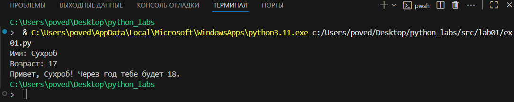
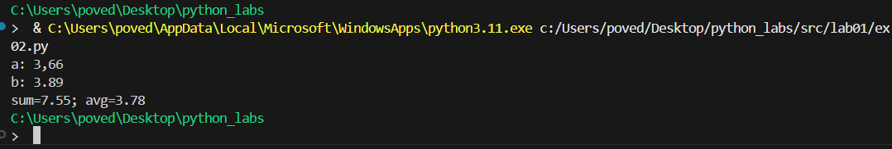
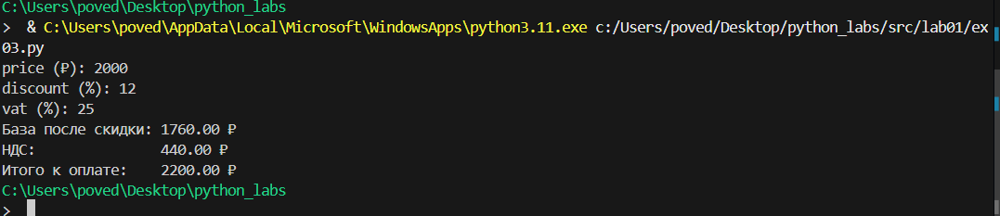
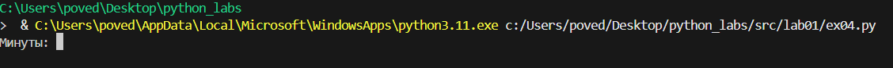
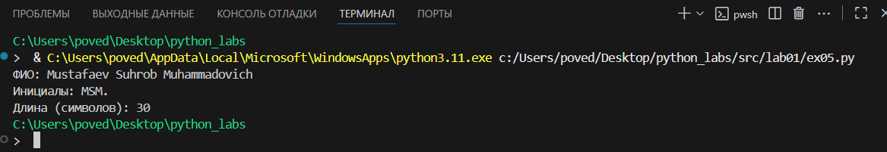

<<<<<<< HEAD
# Лабораторная работа №1
# Ввод/вывод и форматирование в Python

# Цель работы:
Освоить базовые операции ввода-вывода данных, работу с различными типами переменных и форматирование вывода в Python.

# Задание 1: Приветствие и возраст

**Файл:** `src/01_greeting.py`  

**Цель:** Работа со строками и целыми числами, конкатенация строк.

**Ввод:**
- Имя (строка)
- Возраст (целое число)

**Вывод:**


**Пример:**
Имя: Алиса
Возраст: 19
Привет, Алиса! Через год тебе будет 20.# Задание 2: Сумма и среднее арифметическое

**Файл:** `src/02_sum_avg.py`  

**Цель:** Работа с вещественными числами, форматирование вывода.

**Ввод:**
- Два вещественных числа (поддерживаются точка и запятая)

**Вывод:**


**Пример:**
a: 3,5
b: 4.25
sum=7.75; avg=3.88#   Задание 3: Расчет чека со скидкой и НДС

**Файл:** `src/03_discount_vat.py`  

**Цель:** Применение математических формул, сложное форматирование вывода.

**Формулы:**
- `base = price * (1 - discount/100)`
- `vat_amount = base * (vat/100)`
- `total = base + vat_amount`

**Ввод:**
- Цена (вещественное)
- Скидка (%) (вещественное)
- НДС (%) (вещественное)

**Вывод:**


**Пример:**
price (₽): 1000
discount (%): 10
vat (%): 20#   Задание 4: Конвертер минут в часы и минуты

**Файл:** `src/04_minutes_to_hhmm.py`  

**Цель:** Работа с целочисленным делением, форматирование времени.

**Ввод:**
- Минуты (целое число)

**Вывод:**


**Пример:**
Минуты: 135
2:15

#   Задание 5: Инициалы и длина строки


**Файл:** `src/05_initials_and_len.py`
 
**Цель:** Работа со строками, методами строк, форматирование.

**Ввод:**

 ФИО одной строкой (могут быть лишние пробелы)

**Вывод:**




**Пример:**

ФИО: Mustafaev Suhrob Muhammadovich
Инициалы: MSM.
Длина (символов): 30

**Студент:** Мустафаев Сухроб Мухаммадович  
**Группа:** [БИВТ-25-4]  
**Преподаватель:** [Жураковский К.В]

markdown
# ЛР2 — Коллекции и матрицы

## Что я сделал

Я написал программы для работы со списками, матрицами и кортежами на Python. Это моя вторая лабораторная работа, где я учился работать с разными типами коллекций.

## Файлы которые я создал

- `arrays.py` - функции для работы со списками
- `matrix.py` - функции для работы с матрицами  
- `tuples.py` - форматирование записей студентов
- `demo.py` - запуск всех программ вместе

## Как запустить программы

Открываю терминал и пишу:
```bash
python arrays.py
python matrix.py  
python tuples.py
python demo.py
Или можно запустить только demo.py чтобы увидеть всё сразу.

Что делает каждая программа
arrays.py
min_max() - находит самый маленький и самый большой элемент в списке

unique_sorted() - убирает повторяющиеся элементы и сортирует по возрастанию

flatten() - делает из списка списков один большой список

matrix.py
transpose() - меняет строки и столбцы местами в матрице

row_sums() - считает сумму чисел в каждой строке

col_sums() - считает сумму чисел в каждом столбце

tuples.py
format_record() - красиво форматирует информацию о студенте в строку

Примеры работы программ
text
min_max([3, -1, 5, 5, 0]) = (-1, 5)
unique_sorted([3, 1, 2, 1, 3]) = [1, 2, 3]  
format_record(("Иванов Иван", "BIVT-25", 4.6)) = "Иванов И., гр. BIVT-25, GPA 4.60"
Что у меня получилось
Все программы работают правильно и выдают нужные ответы. Я проверял на примерах из задания и всё совпадает. Было интересно работать с матрицами - это как таблицы в программе.

Скриншоты
В папке images/lab02 лежат скриншоты как работают мои программы:

arrays_result.png - результаты arrays.py

matrix_result.png - результаты matrix.py

tuples_result.png - результаты tuples.py

demo_result.png - общий результат

Студент
Мустафаев Сухроб Мухаммадович

Группа
БИВТ-25-4

Преподаватель

