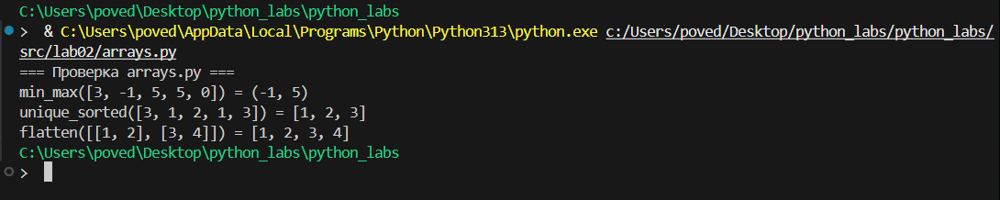
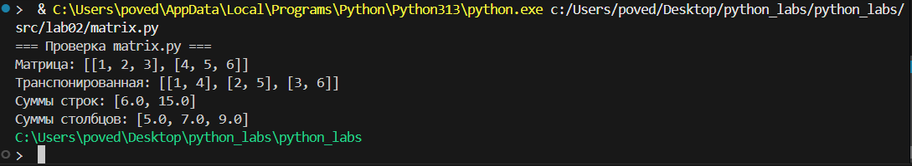
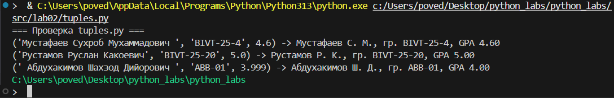
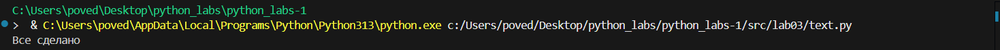
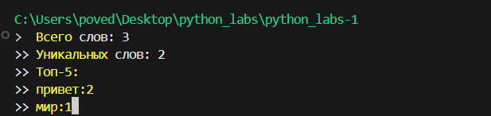
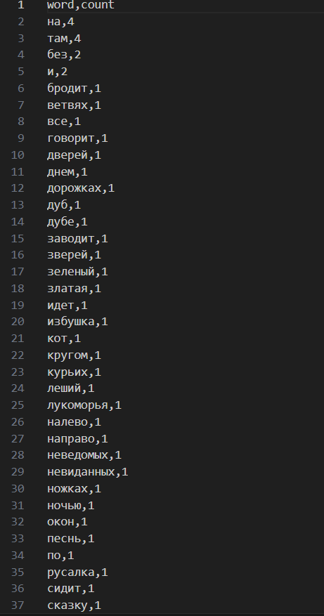
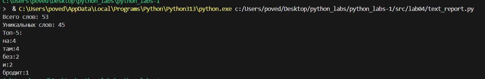

<<<<<<< HEAD
# Лабораторная работа №1
# Ввод/вывод и форматирование в Python

# Цель работы:
Освоить базовые операции ввода-вывода данных, работу с различными типами переменных и форматирование вывода в Python.

# Задание 1: Приветствие и возраст

**Файл:** `src/01_greeting.py`  

**Цель:** Работа со строками и целыми числами, конкатенация строк.

**Ввод:**
- Имя (строка)
- Возраст (целое число)

**Вывод:**


**Пример:**
Имя: Алиса
Возраст: 19
Привет, Алиса! Через год тебе будет 20.# Задание 2: Сумма и среднее арифметическое

**Файл:** `src/02_sum_avg.py`  

**Цель:** Работа с вещественными числами, форматирование вывода.

**Ввод:**
- Два вещественных числа (поддерживаются точка и запятая)

**Вывод:**


**Пример:**
a: 3,5
b: 4.25
sum=7.75; avg=3.88#   Задание 3: Расчет чека со скидкой и НДС

**Файл:** `src/03_discount_vat.py`  

**Цель:** Применение математических формул, сложное форматирование вывода.

**Формулы:**
- `base = price * (1 - discount/100)`
- `vat_amount = base * (vat/100)`
- `total = base + vat_amount`

**Ввод:**
- Цена (вещественное)
- Скидка (%) (вещественное)
- НДС (%) (вещественное)

**Вывод:**


**Пример:**
price (₽): 1000
discount (%): 10
vat (%): 20#   Задание 4: Конвертер минут в часы и минуты

**Файл:** `src/04_minutes_to_hhmm.py`  

**Цель:** Работа с целочисленным делением, форматирование времени.

**Ввод:**
- Минуты (целое число)

**Вывод:**


**Пример:**
Минуты: 135
2:15

#   Задание 5: Инициалы и длина строки


**Файл:** `src/05_initials_and_len.py`
 
**Цель:** Работа со строками, методами строк, форматирование.

**Ввод:**

 ФИО одной строкой (могут быть лишние пробелы)

**Вывод:**


**Пример:**

ФИО: Mustafaev Suhrob Muhammadovich
Инициалы: MSM.
Длина (символов): 30

**Студент:** Мустафаев Сухроб Мухаммадович  
**Группа:** [БИВТ-25-4]  
**Преподаватель:** [Жураковский К.В]


# Лабораторная работа №2
# Коллекции и матрицы

## Что я сделал

Я написал программы для работы со списками, матрицами и кортежами на Python. Это моя вторая лабораторная работа, где я учился работать с разными типами коллекций.

## Файлы которые я создал

- `arrays.py` - функции для работы со списками
- `matrix.py` - функции для работы с матрицами  
- `tuples.py` - форматирование записей студентов


## Как запустить программы

**Открываю терминал и пишу:**
```bash
python arrays.py
python matrix.py  
python tuples.py

```
## Что делает каждая программа
**arrays.py :**
-`min_max()` - находит самый маленький и самый большой элемент в списке

-`unique_sorted()` - убирает повторяющиеся элементы и сортирует по возрастанию

-`flatten()` - делает из списка списков один большой список

**matrix.py :**
-`transpose()` - меняет строки и столбцы местами в матрице

-`row_sums()` - считает сумму чисел в каждой строке

-`col_sums()` - считает сумму чисел в каждом столбце

**tuples.py :**
-`format_record()` - красиво форматирует информацию о студенте в строку

**Примеры работы программ**
***тест arrays.py***
```bash
if __name__ == "__main__":
    print("=== Проверка arrays.py ===")
    
    # Тестируем min_max
    test1 = [3, -1, 5, 5, 0]
    print(f"min_max({test1}) = {min_max(test1)}")
    
    # Тестируем unique_sorted
    test2 = [3, 1, 2, 1, 3]
    print(f"unique_sorted({test2}) = {unique_sorted(test2)}")
    
    # Тестируем flatten
    test3 = [[1, 2], [3, 4]]
    print(f"flatten({test3}) = {flatten(test3)}")
```
**Вывод**
**результаты arrays.py:**


***тест matrix.ru:***
```bash
if __name__ == "__main__":
    print("=== Проверка matrix.py ===")
    
    test_matrix = [[1, 2, 3], [4, 5, 6]]
    print(f"Матрица: {test_matrix}")
    print(f"Транспонированная: {transpose(test_matrix)}")
    print(f"Суммы строк: {row_sums(test_matrix)}")
    print(f"Суммы столбцов: {col_sums(test_matrix)}")
```
**Вывод**
**результаты matrix.py:**

***тест tuples.ru :***
```bash
if __name__ == "__main__":
    print("=== Проверка tuples.py ===")
    
    students = [
        ("Мустафаев Сухроб Мухаммадович ", "BIVT-25-4", 4.6),
        ("Рустамов Руслан Какоевич", "BIVT-25-20", 5.0),
        (" Абдухакимов Шахзод Дийорович ", "ABB-01", 3.999),
    ]
    
    for student in students:
        formatted = format_record(student)
        print(f"{student} -> {formatted}")
```
**Вывод**
**tuples_result.png - результаты tuples.py:**


Все программы работают правильно и выдают нужные ответы. Я проверял на примерах из задания и всё совпадает.
Студент
Мустафаев Сухроб Мухаммадович

Группа
БИВТ-25-4


# Лабораторная работа 
# Тексты и частоты слов

## Что я сделал

Я написал программы для работы с текстом на Python. Это моя третья лабораторная работа, где я учился нормализовать текст, разбивать на слова и считать статистику.

## Файлы которые я создал

- `src/lib/text.py` - функции для работы с текстом
- `src/lab03/text_stats.py` - скрипт для анализа текста

## Как запустить программы

**Открываю терминал и пишу:**
```bash
python src/lib/text.py
python src/lab03/text_stats.py
```
## Что делает каждая программа

**text.py :**
-`normalize()` - приводит текст к нижнему регистру, убирает лишние пробелы
-`tokenize()` - разбивает текст на отдельные слова
-`count_freq()` - считает сколько раз встречается каждое слово
-`top_n()` - находит самые частые слова

**text_stats.py :**
-Читает текст из консоли
-Показывает общую статистику
-Выводит топ-5 самых частых слов
# Примеры работы программ
**Тестирование модуля text.py :**

```bash
python src/lib/text.py
```
**Вывод :**
```
Все тесты пройдены!
```



## Тестирование модуля text_stats.py
```bash
echo "Привет, мир! Привет!!!" | python src/lab03/text_stats.py
```
**Вывод:**
```
Всего слов: 3
Уникальных слов: 2
Топ-5:
привет:2
мир:1
```

Студент: Мустафаев Сухроб Мухаммадович
Группа: БИВТ-25
# ЛР4 — Файлы: TXT/CSV и отчёты по текстовой статистике

## Что я сделал

Я написал программы для чтения текстовых файлов, анализа текста и сохранения результатов в CSV формате. Это продолжение третьей лабораторной работы с добавлением работы с файлами.

## Файлы которые я создал

- `io_txt_csv.py` - функции для чтения текста и записи CSV
- `text_report.py` - скрипт для анализа текста и генерации отчетов

## Как запустить программы

**Базовый запуск:**
```bash
python src/lab04/text_report.py
```
С указанием своих файлов (если добавить argparse):

```bash
python src/lab04/text_report.py --in data/my_text.txt --out data/my_report.csv
```
С другой кодировкой:

```bash
python src/lab04/text_report.py --encoding cp1251
```

**Что делает каждая программа**
***io_txt_csv.py***

-  `read_text()` - читает текстовый файл в указанной кодировке

- `write_csv()` - записывает данные в CSV файл с заголовком

- `ensure_parent_dir()` - создает папки если их нет

***`text_report.py***

- Читает текст из data/lab04/input.txt

- Анализирует слова и их частоты

- Сохраняет результат в data/lab04/report.csv

- Выводит статистику в консоль

Примеры работы
Тест с обычным текстом:
Входной файл data/lab04/input.txt:

```bash
Привет, мир! Привет!!!
```
Запуск:

```bash
python src/lab04/text_report.py
```
Вывод в консоль:

```bash
Всего слов: 3
Уникальных слов: 2
Топ-5:
привет:2
мир:1
```
Файл data/lab04/report.csv:

```bash
word,count
привет,2
мир,1
```
Тест с пустым файлом:
Если **input.txt** пустой, в CSV запишется только заголовок:

```bash
word,count
```
Обработка ошибок:

Если файл не найден: **Ошибка: файл data/lab04/input.txt не найден**

Если неправильная кодировка: **Ошибка кодировки...**

Скриншоты работы:



Все программы работают правильно. Я проверил на разных текстах и кодировках - все функции выполняют свою задачу.

Студент: Мустафаев Сухроб Мухаммадович
Группа: БИВТ-25-4